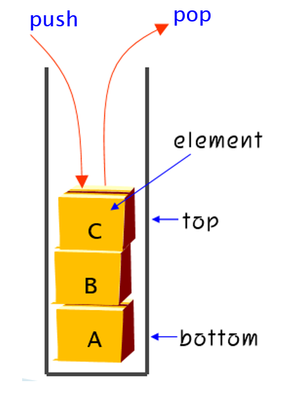

# Data Structure 중간고사 문제 풀이
## 1번
> 다음 순환 공식의 시간복잡도를 Big-Oh 표시법으로 구하는 과정을 보이시오.
>
> T(n) = 2T(n/2) + 1, for n >= 2 with T(1)= 1

해설: O(n)


## 2번
> a) 연결 리스트로 구현된 스택과 큐에서 공백 상태 조건은 각각 무엇인가.
> 
> b) 크기가 7(0~6)이고 front = 3, rear = 6인 원형 큐에서 삽압과 삭제 연산이 가각 1회 수행되었을 때, front와 rear의 값은 각각 얼마인가?

해설:

a) 

스택의 공백상태: top == -1

큐의 공백상태: front == rear


b) 4, 0

- (초기 상태)

    - front = 3: 큐의 첫 번째 원소 위치

    - rear = 6: 큐의 마지막 원소 위치

- (삭제 연산 후)

    - front를 한 칸 앞으로 옮김 (그러나 원형 큐이므로, 한 칸 앞으로 가는 것은 단순히 인덱스를 1 증가시키는 것을 의미함)

- (새로운 front 위치)

    - front = 4

    - rear = 6

- (삽입 연산 후)

    - rear를 한 칸 뒤로 옮김(이 경우, rear가 이미 배열의 끝(6)에 있으므로, 다음 위치는 배열의 시작인 0이 됨)

- (새로운 rear 위치)

    - 6에서 1 증가시키고, 크기 7로 나누면(모듈로 연산) 0이 됨

    - front = 4

    - rear = 0

- (최종 결과)

    - front 위치는 4

    - rear 위치는 0


## 3번
> 다음과 같은 linked stack에 대하여 문제 답하시오
> 
>
> a) pop 연산 수행 코드를 작성하시오
>
> b) 메모리를 할당받아, 데이터필드 값이 'D'인 노드를 push하는 코드를 작성하시오

해설:

a)      //FIXME: PPT 코드로 수정하기
```c
typedef struct Node {
    char data;
    struct Node* next;
} Node;

// Pop function
char pop(Node** top) {
    if (*top == NULL) {                 // 스택이 비어있으면
        printf("Stack is empty.\n");
        return '\0';                    // 스택이 비어있다는 것을 나타내는 특별한 값 반환
    }
    
    Node* temp = *top;                  // 삭제할 노드를 가리키는 임시 포인터
    char data = temp->data;             // 반환할 데이터
    *top = (*top)->next;                // top을 다음 노드로 이동
    free(temp);                         // 노드 메모리 해제
    
    return data;                        // pop된 데이터 반환
}

```
b)      //FIXME: PPT 코드로 수정하기
```c
typedef struct Node {
    char data;
    struct Node* next;
} Node;

// Push function
void push(Node** top, char data) {
    Node* newNode = (Node*)malloc(sizeof(Node)); // 새 노드 메모리 할당
    if (newNode == NULL) {
        printf("Heap overflow\n");
        return;
    }
    
    newNode->data = data;               // 데이터 설정
    newNode->next = *top;               // 새 노드가 이전의 top을 가리키도록 설정
    *top = newNode;                     // top을 새 노드로 업데이트
}
```

main함수(참고용)
```c
// 메인 함수
int main() {
    Node* top = NULL;       // 스택 초기화

                            // Push 연산을 수행하여 스택에 데이터를 추가
    push(&top, 'A');
    push(&top, 'B');
    push(&top, 'C');
    
                            // Pop 연산을 수행하여 스택의 상단 요소를 제거
    printf("Popped: %c\n", pop(&top)); // 'C'를 제거하고 출력
    
                            // 'D' 데이터 값을 가진 노드를 스택에 푸시
    push(&top, 'D');
    
                            // 스택의 현재 상태 출력
    printStack(top);        // 'D', 'B', 'A' 순으로 출력되어야 함

    return 0;
}
```

## 4번
> 연산자들에 대한 PIS와 PIE가 다음과 같때 문제에 답하시오.
>
> a) 중위 표현식 (A * B) + (C ^ D) * E를 후위 표현식으로 변환하시오
>
> b) 변환 중 스택에 쌓이는 연산자의 최대 수는 몊 개인가
>
> |연산자|PIS(Priority In Stack)|PIE( Priority In Expression)|
> |:---:|:---:|:---:|
> |)|-|-|
> |^|2|2|
> |*|3|3|
> |+|4|4|
> |(|1|5|


해설:

a) A B * C D ^ + E *

b) 3개


### 전위중위후위 표기식 개념


### 후위 표기식 연산

### 중위 표기식 연산

### 연산 예제


## 9번
> 다음은 연결리스트에 노드 삽입/삭제 연산을 구현한 것이다.
>
> a) 빈칸(1)과 (2)를 채우시오.
>
> b) 각 노드의 data필드 값을 합산하는 함수(int get_sum(ListNode *head))를 작성하시오.
>```c 
>#include<stdio.h>
>#include<stdlib.h>
>typedef struct ListNode{
>        int data;
>        struct ListNode *link; 
>    }ListNode;
>
>// 노드 pre 뒤에 새로운 노드 p 삽입
>ListNode* insert(ListNode *head, ListNode *pre, int value){
>    ListNode *p = (ListNode *)malloc(sizeof(ListNode));
>    p -> data = value;
>    //a) 코드 작성
>    return head;
>}
>
>// pre가 가리키는 노드의 다음 노드 removed 삭제
>ListNode* delete(ListNode *head, ListNode *pre){
>    ListNode *removed;
>    // b) 코드 작성
>    free(removed);
>    return head;
>}
>```
> |

해설:
a-1)
```c
    if (head == NULL) { // 리스트가 비어있는 경우
        p->link = NULL;
        head = p;
    } else if (pre == NULL) { // 리스트의 시작부에 삽입하는 경우
        p->link = head;
        head = p;
    } else { // 중간이나 끝에 삽입하는 경우
        p->link = pre->link;
        pre->link = p;
    }
```
a-2)
```c
if (pre == NULL && head != NULL) { // 첫 번째 노드를 삭제하는 경우
        removed = head;
        head = head->link;
    } else if (pre->link != NULL) { // 중간이나 끝의 노드를 삭제하는 경우
        removed = pre->link;
        pre->link = removed->link;
    }
```
### 연결 리스트 삽입 연산 코드

### 연결 리스트 삭제 연산 코드


b)
```c
int get_sum(ListNode *head) {
    int sum = 0; // 합산 값을 저장할 변수
    ListNode *current = head; // 현재 노드를 가리키는 포인터

    // 리스트를 순회하면서 각 노드의 data 값을 sum에 더함
    while (current != NULL) {
        sum += current->data;
        current = current->link; // 다음 노드로 이동
    }

    return sum; // 계산된 합산 값 반환
}
```

### 연결 리스트 방문 연산 코드
(위 코드에서는 반복 기법을 사용)


## 10번
> 원형 큐에서 포화상태 조건을 검사한 후 임의의 값을 삽입하는 함수를 작성하시오.
>
> ```C 
> void enqueue(QueueType *q, element item)
> ```

해설:
```c
void enqueue(QueueType *q, element item)
{   if( ((q->rear+1) % MAX_QUEUE_SIZE == q->front) )
        error("큐가 포화상태입니다");
    q->rear = (q->rear+1) % MAX_QUEUE_SIZE;
    q->queue[q->rear] = item;
}

```
### 큐의 연산


# 개념 정리
## Stack

  스택에 저장된 원소는 top으로 정한 곳에서만 접근 가능

is_empty(s) ::= 스택이 비어있는지를 검사 

is_full(s) ::= 스택이 가득 찼는가를 검사

push(s, e) ::= 스택의 맨 위에 요소 e를 추가

pop(s) ::= 스택의 맨 위에 있는 요소를 삭제

peek(s) ::= 스택의 맨 위에 있는 요소를 반환

size(s) ::= 스택 내의 요소들의 개수를 반환

display(s) ::= 스택 내의 모든 요소들을 

### 스택



### 다중 스택


### 함수 호출&반환 과정(스택)


### 괄호 검사


### 후위 표기식 연산


### 중위 표기식 연산


### 연산 예제


### 다중 스택 과정


//TODO: DFS, 미로탐색(트리 문제 대신에 낼만함)

//TODO: 리스트 인덱스 주소 구하는 문제

//TODO: Big-O 최선 최악

//TODO: 다중스택 작업 순서

//TODO: 퀵소트, 피봇, 파티션 (10번문제)

//TODO: 퀴즈문제 정리